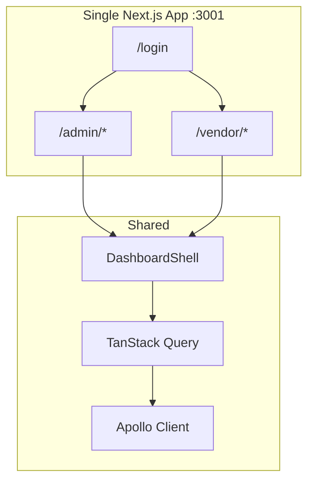

# Admin Architecture

## Stack

| Layer             | Technology            | Version        |
| ----------------- | --------------------- | -------------- |
| Framework         | Next.js (App Router)  | 16.2.9         |
| UI                | React                 | 19.2.4         |
| Styling           | Tailwind CSS          | 4              |
| GraphQL transport | Apollo Client         | 4.2.4          |
| Server state      | TanStack Query        | 5.101.2        |
| Forms             | react-hook-form + zod | 7.80 / 4.4     |
| Client state      | Zustand               | 5.0.14         |
| Tables            | TanStack Table        | 8.21.3         |
| Testing           | Vitest + Playwright   | 4.1.9 / 1.61.1 |

## Dual portal design



**Why one app:** Admin and vendor share UI primitives, auth, GraphQL client, and layout shell. Role-based routing separates concerns without duplicating infrastructure.

## Data layer

```
Page → hooks/useX.ts (TanStack Query) → lib/api/x.ts (executeQuery) → graphql/client.ts → /graphql
```

**Exception:** Notifications use Apollo `useQuery` directly (`lib/hooks/useNotifications.ts`).

## Auth layers

```mermaid
flowchart TD
  REQ[Request to /admin or /vendor]
  REQ --> PX[proxy.ts<br/>cookie + JWT role]
  PX -->|redirect| LOGIN[/login]
  PX -->|pass| PAGE[Page render]
  PAGE --> AG[AuthGuard<br/>Zustand hydration]
  AG -->|redirect| LOGIN
  AG --> UI[Dashboard UI]
```

## State

| Store  | File                     | Persisted    | Purpose               |
| ------ | ------------------------ | ------------ | --------------------- |
| Auth   | `stores/auth.store.ts`   | localStorage | User, isAuthenticated |
| Vendor | `stores/vendor.store.ts` | localStorage | activeStoreId         |

## Related docs

- [Routing](routing.md)
- [Authentication](authentication.md)
- [Data fetching](data-fetching.md)
