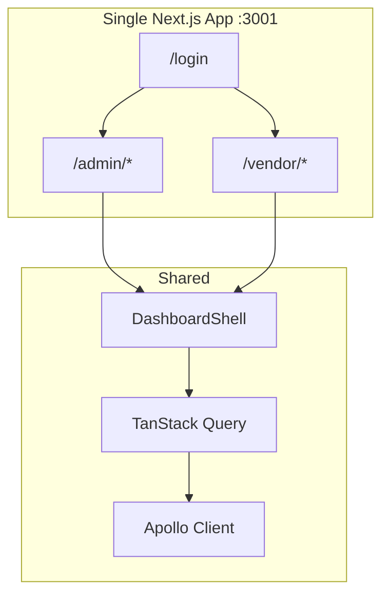

# Admin Architecture

## Stack

| Layer             | Technology            | Version (package.json) |
| ----------------- | --------------------- | ---------------------- |
| Framework         | Next.js (App Router)  | 16.2.9                 |
| UI                | React                 | 19.2.4                 |
| Styling           | Tailwind CSS          | 4                      |
| GraphQL transport | Apollo Client         | 4.2.4                  |
| Server state      | TanStack Query        | 5.101.2                |
| Forms             | react-hook-form + zod | 7.80 / 4.4             |
| Client state      | Zustand               | 5.0.14                 |
| Tables            | TanStack Table        | 8.21.3                 |
| Testing           | Vitest + Playwright   | 4.1.9 / 1.61.1         |

Package manager: **Yarn 1.22+** (`only-allow yarn`). Node.js **20+** (CI uses Node 20).

## Dual portal design



Admin and vendor share UI primitives, auth, GraphQL transport, TanStack Query, and `DashboardShell`. Role-based routes and layouts separate concerns without duplicating infrastructure.

## Data layer

```text
Page → hooks/useX.ts (TanStack Query) → lib/api/x.ts → graphql/client.ts → /graphql → backend :3002
```

Browser GraphQL uses same-origin `/graphql` (rewritten in `next.config.ts`). SSR uses `GRAPHQL_SSR_URL` (default `http://localhost:3002/graphql`).

**Exception:** Notification pages import Apollo hooks from `src/lib/hooks/useNotifications.ts` (polling). See [data-fetching.md](data-fetching.md).

## Auth layers

```mermaid
flowchart TD
  REQ[Request to /admin, /vendor, or /register]
  REQ --> PX[proxy.ts<br/>cookie + JWT role]
  PX -->|redirect| LOGIN[/login or role dashboard]
  PX -->|pass| PAGE[Page render]
  PAGE --> AG[AuthGuard<br/>Zustand hydration]
  AG -->|redirect| LOGIN
  AG --> UI[Dashboard UI]
```

Details: [authentication.md](authentication.md).

## Client state

| Store  | File                     | Persisted key        | Purpose                       |
| ------ | ------------------------ | -------------------- | ----------------------------- |
| Auth   | `stores/auth.store.ts`   | `sopet-admin-auth`   | User, `isAuthenticated`       |
| Vendor | `stores/vendor.store.ts` | `sopet-vendor-store` | `activeStoreId` (multi-store) |

Server/async data lives in TanStack Query (`src/lib/react-query/`), not Zustand.

## Boundaries

| This app owns                        | Backend owns                         |
| ------------------------------------ | ------------------------------------ |
| Admin/vendor UI, forms, client cache | Schema, business rules, PostgreSQL   |
| JWT cookies + role redirects         | Login, refresh, authorization        |
| Codegen from `schema.gql`            | Source of truth for GraphQL contract |

No direct database access from this repo.

## Related docs

- [Folder structure](folder-structure.md)
- [Routing](routing.md)
- [Authentication](authentication.md)
- [Data fetching](data-fetching.md)
