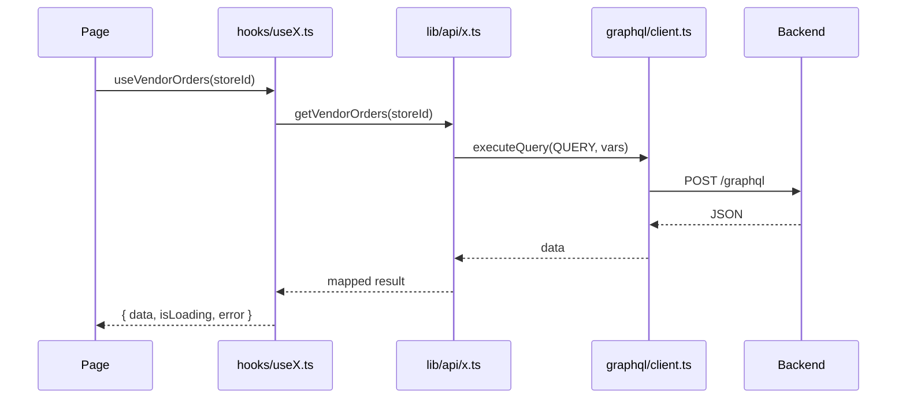

# Data Fetching

## Architecture



Do not call Apollo Client from page/components for normal server state. Use a hook in `src/hooks/`.

## TanStack Query (primary)

**Provider:** `src/lib/react-query/provider.tsx` (mounted from `src/lib/providers.tsx`).

Defaults:

| Option                 | Value  |
| ---------------------- | ------ |
| `staleTime`            | 60_000 |
| `retry`                | 1      |
| `refetchOnWindowFocus` | false  |

**Query keys:** `src/lib/react-query/keys.ts` — namespaced factories per domain (`orders`, `products`, `taxonomy`, `analytics`, …).

**Hook pattern:**

```typescript
// src/hooks/useVendorOrders.ts
export function useVendorOrders(storeId?: string) {
  return useQuery({
    staleTime: 0, // order status changes frequently
    queryKey: queryKeys.orders.vendor(storeId ?? ''),
    queryFn: () => getVendorOrders(storeId!),
    enabled: !!storeId,
  });
}
```

**Mutations:** invalidate with root keys; use `meta: { toastError: true }` when the toast middleware should show failures.

```typescript
// src/hooks/useVendorOrderWorkflow.ts
export function useMarkVendorOrderPaid() {
  const queryClient = useQueryClient();
  return useMutation({
    meta: { toastError: true },
    mutationFn: (orderId: string) => markVendorOrderPaid(orderId),
    onSuccess: () => queryClient.invalidateQueries({ queryKey: queryKeys.orders.vendorRoot() }),
  });
}
```

## `lib/api` (GraphQL service layer)

Modules under `src/lib/api/` call GraphQL via `executeQuery` / `executeMutation` from `src/lib/graphql/client.ts`.

Despite the folder name, this is **not REST**. Most operation documents live in `src/lib/graphql/documents.ts`; mappers often live in `src/lib/graphql/mappers.ts` or beside the API module.

```typescript
// src/lib/api/orders.ts
import { executeQuery } from '@/lib/graphql/client';
import { VENDOR_ORDERS_QUERY } from '@/lib/graphql/documents';
import { mapOrder } from '@/lib/graphql/mappers';

export function getVendorOrders(storeId: string) {
  return executeQuery(VENDOR_ORDERS_QUERY, { storeId }).then((data) =>
    data.vendorOrders.map(mapOrder),
  );
}
```

## Apollo Client (transport)

`src/lib/graphql/client.ts`:

- `HttpLink` to `GRAPHQL_URL` from `src/lib/config.ts`
- Optional `GraphQLWsLink` (`graphql-ws`) for subscription operations; WS URL from `getGraphqlWsUrl()`
- Auth header from cookies
- Auth refresh retry on unauthorized responses
- `ApolloProvider` in `src/lib/providers.tsx`
- `executeQuery` defaults to `fetchPolicy: 'network-only'` so TanStack invalidation/refetch always hits the network (not Apollo `InMemoryCache`)
- `executeMutation` awaits `cache.reset()` unless `skipCacheReset: true` (e.g. taxonomy)

Apollo is the transport; TanStack Query is the React cache for most screens. Notification unread polling uses Apollo HTTP `useQuery`, not a required browser WS setup in `.env.example`.

## Apollo hooks (exception)

`src/lib/hooks/useNotifications.ts` — Apollo `useQuery` with polling (`pollInterval` 15s for unread tab).

Admin and vendor notification pages import this file. A parallel TanStack Query API exists at `src/hooks/useNotifications.ts` but those pages do not use it.

## GraphQL operations & codegen

| Source           | Location                                                                    |
| ---------------- | --------------------------------------------------------------------------- |
| Inline `gql`     | `src/lib/graphql/documents.ts` (majority of operations)                     |
| `.graphql` files | `src/lib/graphql/operations/` — search, notifications, promotions, taxonomy |
| Generated        | `src/lib/graphql/generated/graphql.ts`                                      |

```bash
yarn graphql:codegen   # ensure schema → codegen → duplicate check → Prettier
yarn graphql:watch     # watch mode (codegen only)
```

`prebuild` and `pretype-check` both run `yarn graphql:codegen`.

Schema resolution (`codegen.ts` + `scripts/ensure-graphql-schema.mjs`):

1. `GRAPHQL_SCHEMA_PATH` if set
2. Else local `../sopet-backend/src/schema.gql` or `sopet-backend/src/schema.gql`
3. Else optional GitHub fetch in CI (see `.env.example` `GRAPHQL_SCHEMA_GITHUB_*`)

## Nav prefetch

`src/lib/react-query/prefetch-dashboard-nav.ts` — prefetches route data on sidebar hover/focus (`DashboardShell`).

## Error handling

| Helper / UI         | Location                               |
| ------------------- | -------------------------------------- |
| `getErrorMessage()` | `src/lib/api/errors.ts`                |
| Thai message map    | `src/lib/api/error-messages.ts`        |
| `QueryErrorState`   | `src/components/query-error-state.tsx` |

## External REST API

Vendor product import (`POST /api/v1/stores/:storeId/products`) is documented in-app at `/vendor/api/docs`. `getApiBaseUrl()` in `src/lib/config.ts` builds that base URL for docs display. Admin `lib/api/` modules do not call it.

## Related docs

- [Feature development](feature-development.md)
- [Folder structure](folder-structure.md)
- Storefront GraphQL ops differ: [../sopet-storefront/docs/graphql.md](../../sopet-storefront/docs/graphql.md)
