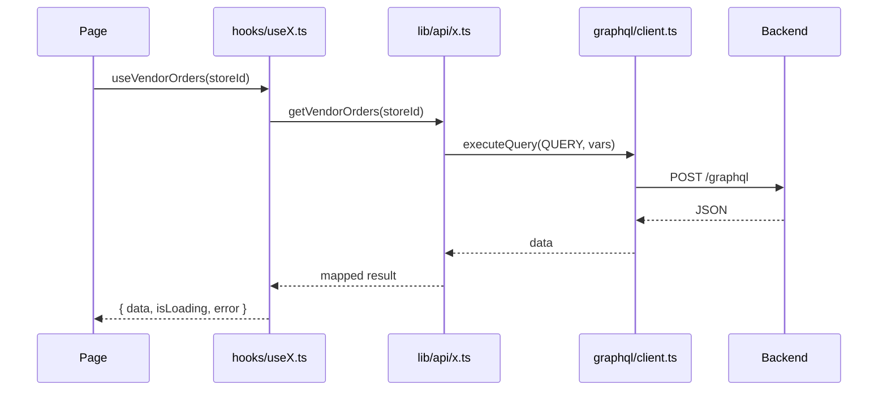

# Data Fetching

## Architecture



## TanStack Query (primary)

**Provider:** `src/lib/react-query/provider.tsx`

Defaults:

- `staleTime: 60_000` (60s)
- `retry: 1`
- `refetchOnWindowFocus: false`

**Query keys:** `src/lib/react-query/keys.ts` — one namespace per domain, e.g.:

```typescript
export const queryKeys = {
  orders: {
    all: ['orders'] as const,
    vendorRoot: () => ['orders', 'vendor'] as const,
    vendor: (storeId: string) => ['orders', 'vendor', storeId] as const,
  },
  // ...other domains
};
```

**Hook pattern:**

```typescript
// src/hooks/useVendorOrders.ts
export function useVendorOrders(storeId?: string) {
  return useQuery({
    staleTime: 0, // order status changes frequently
    queryKey: queryKeys.orders.vendor(storeId ?? ''),
    queryFn: () => getVendorOrders(storeId!),
    enabled: !!storeId,
  });
}
```

**Mutations:**

```typescript
// src/hooks/useVendorOrderWorkflow.ts
export function useMarkVendorOrderPaid() {
  const queryClient = useQueryClient();
  return useMutation({
    meta: { toastError: true },
    mutationFn: (orderId: string) => markVendorOrderPaid(orderId),
    onSuccess: () => queryClient.invalidateQueries({ queryKey: queryKeys.orders.vendorRoot() }),
  });
}
```

## lib/api (GraphQL service layer)

All modules in `src/lib/api/` call GraphQL via `executeQuery`/`executeMutation`.

**Not REST** — folder name is historical. Operations from `src/lib/graphql/documents.ts`.

```typescript
// src/lib/api/orders.ts
import { executeQuery } from '@/lib/graphql/client';
import { VENDOR_ORDERS_QUERY } from '@/lib/graphql/documents';
import { mapOrder } from '@/lib/graphql/mappers';

export function getVendorOrders(storeId: string) {
  return executeQuery(VENDOR_ORDERS_QUERY, { storeId }).then((data) =>
    data.vendorOrders.map(mapOrder),
  );
}
```

## Apollo Client (transport)

`src/lib/graphql/client.ts`:

- `HttpLink` to `GRAPHQL_URL`
- Auth header from cookies
- `withAuthRetry` for 401
- `ApolloProvider` in `providers.tsx`

Apollo is **not** the primary React data layer.

## Apollo hooks (exception)

`src/lib/hooks/useNotifications.ts` — direct `useQuery` with polling.

Used by admin/vendor notification pages. A TanStack Query version exists at `src/hooks/useNotifications.ts` but pages use the Apollo version.

## GraphQL operations

| Source         | Location                                                                    |
| -------------- | --------------------------------------------------------------------------- |
| Inline gql     | `src/lib/graphql/documents.ts` (majority of operations)                     |
| .graphql files | `src/lib/graphql/operations/` (search, notifications, promotions, taxonomy) |
| Generated      | `src/lib/graphql/generated/graphql.ts`                                      |

Codegen: `yarn graphql:codegen` (runs on `prebuild`, `pretype-check`).

## Nav prefetch

`src/lib/react-query/prefetch-dashboard-nav.ts` — prefetches route data on sidebar hover/focus.

## Error handling

- `getErrorMessage()` from `src/lib/api/errors.ts`
- Thai messages from `src/lib/api/error-messages.ts`
- `QueryErrorState` / `MutationErrorState` components

## External REST API

Vendor product import API (`POST /api/v1/stores/:storeId/products`) is documented at `/vendor/api/docs` for external consumers. The admin app does not call it from `lib/api/`.

`getApiBaseUrl()` in `config.ts` builds the URL for documentation display only.

## Related docs

- [GraphQL operations](../../sopet-storefront/docs/graphql.md) (storefront pattern differs)
- [Feature development](feature-development.md)
