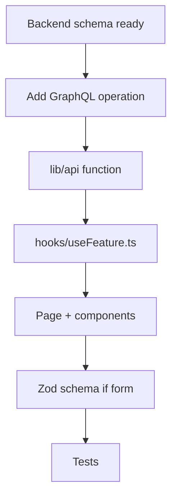

# Feature Development (Admin)

## Workflow



## Example: admin page for a new GraphQL query

### 1. Add operation

Prefer inline documents for one-off admin ops; use `.graphql` + codegen when sharing typed documents (search, notifications, promotions, taxonomy already do).

```typescript
// src/lib/graphql/documents.ts
export const MY_ADMIN_QUERY = gql`
  query MyAdminData($filter: String) {
    myAdminData(filter: $filter) {
      id
      name
    }
  }
`;
```

### 2. API layer

```typescript
// src/lib/api/my-feature.ts
import { executeQuery } from '@/lib/graphql/client';
import { MY_ADMIN_QUERY } from '@/lib/graphql/documents';

export async function fetchMyAdminData(filter?: string) {
  const data = await executeQuery(MY_ADMIN_QUERY, { filter });
  return data.myAdminData;
}
```

### 3. Hook

```typescript
// src/lib/react-query/keys.ts — add a domain namespace
// myAdminData: { all: ['myAdminData'] as const, list: (filter?: string) => … }

// src/hooks/useMyAdminData.ts
import { useQuery } from '@tanstack/react-query';
import { fetchMyAdminData } from '@/lib/api/my-feature';
import { queryKeys } from '@/lib/react-query/keys';

export function useMyAdminData(filter?: string) {
  return useQuery({
    queryKey: queryKeys.myAdminData.list(filter),
    queryFn: () => fetchMyAdminData(filter),
  });
}
```

### 4. Page

```typescript
// src/app/admin/my-feature/page.tsx
'use client';

import { useMyAdminData } from '@/hooks/useMyAdminData';
import { QueryErrorState } from '@/components/query-error-state';

export default function MyFeaturePage() {
  const { data, isLoading, error, refetch } = useMyAdminData();
  if (error) return <QueryErrorState error={error} onRetry={refetch} />;
  if (isLoading) return <p>กำลังโหลด...</p>;
  return null; // render data
}
```

### 5. Add nav item

Update `src/components/admin/admin-layout.tsx` (or `vendor-layout.tsx`) nav sections.

### 6. Test

- Unit: `src/hooks/useMyAdminData.test.ts` — mock `lib/api`
- Page/component: colocated `*.test.tsx`
- Browser: `e2e/my-feature.spec.ts` with admin auth fixture when the flow needs a real page load

## Form feature requirements

When adding a form:

1. Zod schema in `lib/validations/` with Thai messages
2. `react-hook-form` + `zodResolver`
3. Mutation hook that `invalidateQueries` on success
4. `meta: { toastError: true }` when toast-on-error is desired
5. Surface API failures with `getErrorMessage()`

## Vendor vs admin

| Concern      | Admin               | Vendor               |
| ------------ | ------------------- | -------------------- |
| Route prefix | `/admin/`           | `/vendor/`           |
| Auth role    | `admin`             | `vendor`             |
| Store scope  | Platform-wide       | `useVendorStoreId()` |
| Components   | `components/admin/` | `components/vendor/` |

## Cross-repo coordination

1. Change API/schema in `../sopet-backend` and regenerate `src/schema.gql` (`yarn start:dev`).
2. Run `yarn graphql:codegen` in this repo (and `../sopet-storefront` if the customer UI is affected).
3. Implement UI/hooks here; commit each repo separately. Merge backend before frontend CI that depends on the new schema.

## Related docs

- [Data fetching](data-fetching.md)
- [Forms & validation](forms-validation.md)
- [Development guide](development-guide.md)
