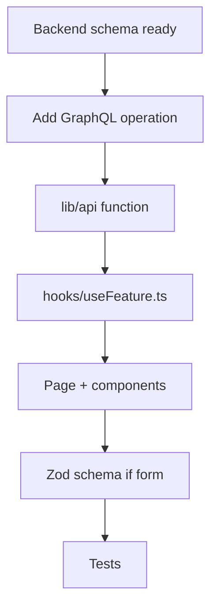

# Feature Development (Admin)

## Workflow



## Example: admin page for new GraphQL query

### 1. Add operation

```typescript
// src/lib/graphql/documents.ts
export const MY_ADMIN_QUERY = gql`
  query MyAdminData($filter: String) {
    myAdminData(filter: $filter) {
      id
      name
    }
  }
`;
```

### 2. API layer

```typescript
// src/lib/api/my-feature.ts
import { executeQuery } from '@/lib/graphql/client';
import { MY_ADMIN_QUERY } from '@/lib/graphql/documents';

export async function fetchMyAdminData(filter?: string) {
  const data = await executeQuery(MY_ADMIN_QUERY, { filter });
  return data.myAdminData;
}
```

### 3. Hook

```typescript
// src/hooks/useMyAdminData.ts
import { useQuery } from '@tanstack/react-query';
import { fetchMyAdminData } from '@/lib/api/my-feature';

export function useMyAdminData(filter?: string) {
  return useQuery({
    queryKey: ['myAdminData', filter],
    queryFn: () => fetchMyAdminData(filter),
  });
}
```

### 4. Page

```typescript
// src/app/admin/my-feature/page.tsx
'use client';

import { useMyAdminData } from '@/hooks/useMyAdminData';
import { QueryErrorState } from '@/components/query-error-state';

export default function MyFeaturePage() {
  const { data, isLoading, error, refetch } = useMyAdminData();
  if (error) return <QueryErrorState error={error} onRetry={refetch} />;
  if (isLoading) return <p>กำลังโหลด...</p>;
  return (/* render data */);
}
```

### 5. Add nav item

Update `src/components/admin/admin-layout.tsx` nav sections.

### 6. Test

```typescript
// src/hooks/useMyAdminData.test.ts — mock lib/api
// e2e/my-feature.spec.ts — Playwright with admin auth fixture
```

## Form feature checklist

- [ ] Zod schema in `lib/validations/`
- [ ] `react-hook-form` + `zodResolver`
- [ ] Mutation hook with `invalidateQueries`
- [ ] `meta: { toastError: true }` for automatic error toasts
- [ ] Thai validation messages

## Vendor vs admin

| Concern      | Admin               | Vendor               |
| ------------ | ------------------- | -------------------- |
| Route prefix | `/admin/`           | `/vendor/`           |
| Auth role    | `admin`             | `vendor`             |
| Store scope  | Platform-wide       | `useVendorStoreId()` |
| Components   | `components/admin/` | `components/vendor/` |

## Cross-repo coordination

See [workspace cross-repo workflow](../../new-sopet-workspace/docs/developer/cross-repo-workflow.md).

## Related docs

- [Data fetching](data-fetching.md)
- [Forms & validation](forms-validation.md)
