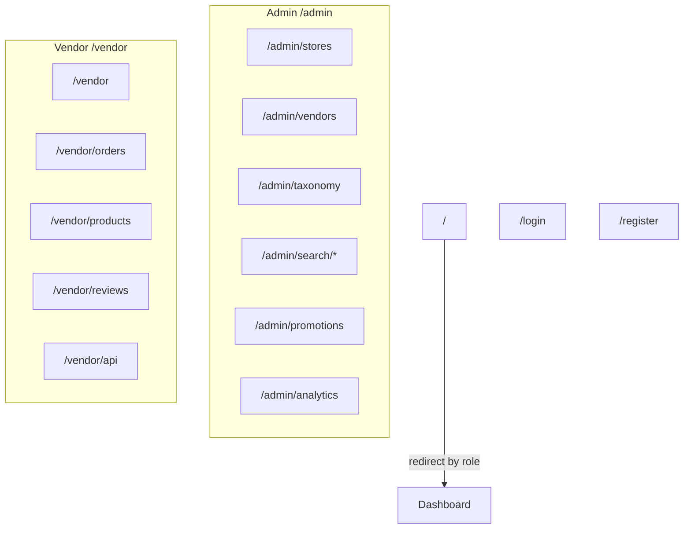

# Admin Routing

## Route overview

## Admin routes (`src/app/admin/`)

| Route                                  | Purpose                                    |
| -------------------------------------- | ------------------------------------------ |
| `/admin`                               | Redirect to `/admin/analytics`             |
| `/admin/analytics`                     | Platform analytics                         |
| `/admin/stores`                        | Store approval and management              |
| `/admin/stores/new`                    | Create store (admin-created)               |
| `/admin/stores/[id]`                   | Store detail                               |
| `/admin/vendors`                       | Vendor management                          |
| `/admin/vendors/[id]`                  | Vendor detail                              |
| `/admin/customers`                     | Customer management                        |
| `/admin/customers/[id]`                | Customer detail                            |
| `/admin/taxonomy`                      | Pet types, categories, tags, brands        |
| `/admin/taxonomy/categories/[id]/edit` | Edit category                              |
| `/admin/taxonomy/pet-types/[id]/edit`  | Edit pet type                              |
| `/admin/search/tuning`                 | Search ranking weights                     |
| `/admin/search/synonyms`               | Search synonym management                  |
| `/admin/search/analytics`              | Search analytics                           |
| `/admin/promotions`                    | Platform promotions                        |
| `/admin/promotions/new`                | New promotion — type picker                |
| `/admin/promotions/new/[type]`         | New promotion — type-specific form         |
| `/admin/promotions/[id]/edit`          | Edit promotion                             |
| `/admin/shipping`                      | Platform shipping settings                 |
| `/admin/settings`                      | Platform settings (banners, sponsors, ads) |
| `/admin/team`                          | Admin team                                 |
| `/admin/audit-logs`                    | Admin audit log                            |
| `/admin/notifications`                 | Admin notifications                        |
| `/admin/profile`                       | Admin profile                              |
| `/admin/requests`                      | Store + vendor invite request center       |
| `/admin/reactivation-requests`         | Suspended-store reactivation requests      |

Nav: `src/components/admin/admin-layout.tsx`.

Post-login / unauthorized-vendor-away dashboard for admins is `/admin/stores` (`getDashboardPath`). The `/admin` index still redirects to analytics.

## Vendor routes (`src/app/vendor/`)

| Route                            | Purpose                                                                    |
| -------------------------------- | -------------------------------------------------------------------------- |
| `/vendor`                        | Dashboard                                                                  |
| `/vendor/stores`                 | Store hub (settings, requests, reactivation entry points)                  |
| `/vendor/orders`                 | Order fulfillment; row actions (detail dialog + copy public tracking link) |
| `/vendor/products`               | Product catalog                                                            |
| `/vendor/products/new`           | Create product                                                             |
| `/vendor/products/[id]/edit`     | Edit product                                                               |
| `/vendor/products/[id]/variants` | Manage product variants                                                    |
| `/vendor/reviews`                | Review management + replies                                                |
| `/vendor/customers`              | Customer list                                                              |
| `/vendor/customers/[id]`         | Customer detail                                                            |
| `/vendor/promotions`             | Store promotions                                                           |
| `/vendor/promotions/new`         | New promotion — type picker                                                |
| `/vendor/promotions/new/[type]`  | New promotion — type-specific form                                         |
| `/vendor/promotions/[id]/edit`   | Edit promotion                                                             |
| `/vendor/team`                   | Team (owners only in nav)                                                  |
| `/vendor/api`                    | API keys                                                                   |
| `/vendor/api/docs`               | External vendor REST API documentation                                     |
| `/vendor/settings`               | Store settings                                                             |
| `/vendor/notifications`          | Notifications                                                              |
| `/vendor/reactivation`           | Reactivation request for a suspended store                                 |
| `/vendor/invitations/accept`     | Legacy invite link — redirects to `/invite/store?token=…`                  |
| `/vendor/requests`               | Legacy route — redirects to `/vendor/stores`                               |

Nav: `src/components/vendor/vendor-layout.tsx`. Role-gated items via `useIsStoreOwner()`, `useIsStoreManager()`.

## Shared / auth routes (`src/app/`)

| Route              | Purpose                                             |
| ------------------ | --------------------------------------------------- |
| `/`                | Client redirect to role dashboard or `/login`       |
| `/login`           | Email + password login (admin and vendor)           |
| `/register`        | Vendor self-registration (new store request)        |
| `/register/invite` | Accept a store team-member invitation               |
| `/reset-password`  | Password reset flow                                 |
| `/verify-email`    | Vendor email verification link landing page         |
| `/invite/store`    | Accept a store team-member invitation (token-based) |

## Auth protection

1. **`src/proxy.ts`** — matcher `/admin/*`, `/vendor/*`, `/register`, `/register/*`
2. **`AuthGuard`** in each portal layout (`admin` / `vendor` role)

Details: [authentication.md](authentication.md).

## Error boundaries

| File                       | Scope         |
| -------------------------- | ------------- |
| `src/app/admin/error.tsx`  | Admin portal  |
| `src/app/vendor/error.tsx` | Vendor portal |
| `src/app/error.tsx`        | App           |
| `src/app/global-error.tsx` | Root          |

## Related docs

- [Authentication](authentication.md)
- [Architecture](architecture.md)
