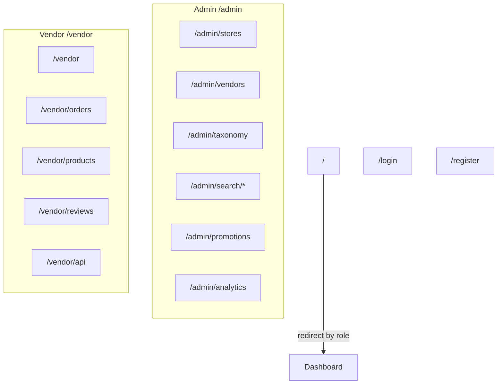

# Admin Routing

## Route overview

## Admin routes (`src/app/admin/`)

| Route                          | Purpose                          |
| ------------------------------ | -------------------------------- |
| `/admin`                       | Redirect to stores               |
| `/admin/stores`                | Store approval and management    |
| `/admin/vendors`               | Vendor management                |
| `/admin/customers`             | Customer management              |
| `/admin/taxonomy`              | Pet types, categories, brands    |
| `/admin/search/tuning`         | Search ranking weights           |
| `/admin/search/synonyms`       | Search synonym management        |
| `/admin/search/analytics`      | Search analytics                 |
| `/admin/promotions`            | Platform promotions              |
| `/admin/shipping`              | Platform shipping settings       |
| `/admin/settings`              | Platform settings (banners, ads) |
| `/admin/analytics`             | Platform analytics               |
| `/admin/team`                  | Admin team                       |
| `/admin/notifications`         | Admin notifications              |
| `/admin/requests`              | Store requests                   |
| `/admin/reactivation-requests` | Reactivation requests            |

Nav defined in `src/components/admin/admin-layout.tsx`.

## Vendor routes (`src/app/vendor/`)

| Route                   | Purpose                     |
| ----------------------- | --------------------------- |
| `/vendor`               | Dashboard                   |
| `/vendor/stores`        | Store settings              |
| `/vendor/orders`        | Order fulfillment           |
| `/vendor/products`      | Product catalog             |
| `/vendor/reviews`       | Review management + replies |
| `/vendor/customers`     | Customer list               |
| `/vendor/promotions`    | Store promotions            |
| `/vendor/team`          | Team (owners only in nav)   |
| `/vendor/api`           | API keys                    |
| `/vendor/api/docs`      | REST API documentation      |
| `/vendor/settings`      | Store settings              |
| `/vendor/notifications` | Notifications               |

Nav defined in `src/components/vendor/vendor-layout.tsx`. Role-gated items via `useIsStoreOwner()`, `useIsStoreManager()`.

## Auth protection

1. **`src/proxy.ts`** — matcher `['/admin/:path*', '/vendor/:path*']`
2. **`AuthGuard`** in each portal layout

## Root page

`src/app/page.tsx` — redirects authenticated users to role dashboard.

## Error boundaries

- `src/app/admin/error.tsx`
- `src/app/vendor/error.tsx`
- `src/app/error.tsx`, `global-error.tsx`

## Related docs

- [Authentication](authentication.md)
- [Architecture](architecture.md)
